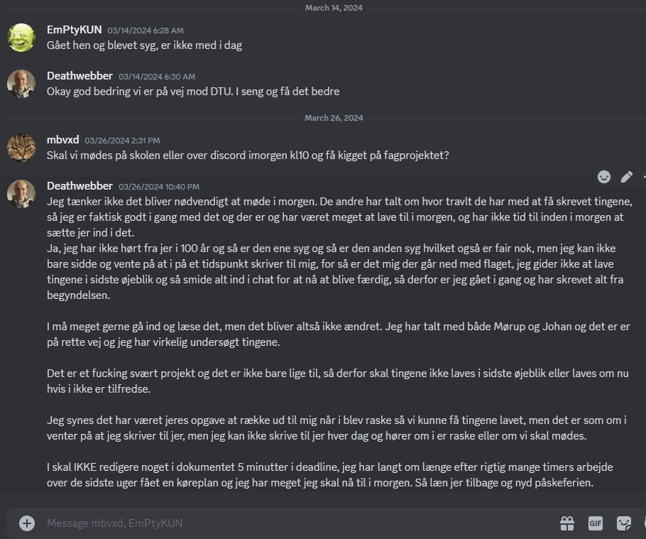

## Logbook for project
Created: 07.02.24
Last update: 14.02.24
By: See Git log history

### 07.02.2024. 
An agreement contract has been established after a long, but positive, discussion. We have decided to use a planning tool called PLANE to help us keep track of each main task and subtask. We have sent an email to our two project mentors regarding the first meeting, expressing our desire for guidance from the mentors. We would like to know which aspects of point cloud technology they are particularly interested in to ensure they can be a strong resource for our project. We have agreed to individual brainstorm ideas for research questions, in case project mentors do not provide any strong interest/guidons on this area.
*Added: We created a Git repository where all files we be uploaded to. We plan to make it public after exam and use it for our individual portfolio.
*Added: We requested access to https://shapenet.org/ where the Dataset is located.  

### 14.02.2024
Since our last meeting, one of our project supervisors, Johan Ziruo Ye, has responded and we have agreed on a virtual meeting on Microsoft Teams on 14.02.24 at 15:00. Our request to gain access to [ShapeNet](https://shapenet.org/) has also been approved. We have agreed to read the three scientific papers provided in the project description ([Paper 1](https://arxiv.org/abs/2105.05233), [Paper 2](https://arxiv.org/abs/1612.00593), [Paper 3](https://arxiv.org/abs/2103.01458)). We discussed them, how they are structured, and how we can draw inspiration from them in forming our own problem formulation, while keeping in mind what we read in the Danish book "Styrk Projektarbejdet" (3rd edition).

We discussed the importance of being very precise in the project description due to the high level of complexity surrounding the subject.

For the meeting, we have prepared some questions:
- The scientific papers use the pronoun "we" every time they describe an action. Would we benefit from using it too, so the end reader will know which steps the project took?
- Is it allowed to use PLANE for the Gantt Cart, the planning tool provides. (Do the supervisors wanted to be invited to the PLANE project?)

Also:
- We hope the supervisor can help us scope the project to the right size.

All members is setup to use the planning tool [PLANE](https://app.plane.so/)

After the meeting with our supervisor we got another research paper on diffusion models. We agreed that we will take a meeting one time per week, and to next time we will read and try to get a good understanding of the theory, models which is used. 

We also agreed that for now our main research question is going to be how to transform the diffusions models used on 2D data in the papers, into a test to see we can bring down the step using the same methods, but using 3D data shapes instead.

### 21.02.2024
Since last week we have read the article given by our supervisor and seen the YouTube video [DDPM - Diffusion Models Beat GANs on Image Synthesis (Machine Learning Research Paper Explained)](https://www.youtube.com/watch?v=W-O7AZNzbzQ) and [Diffusion Models | Paper Explanation | Math Explained](https://www.youtube.com/watch?v=HoKDTa5jHvg) and got a "overall" understanding of the subject diffusion models and how they were used in the scientific papers.
Today we are make a draft for the Project Canvas and brainstorming on which research question the project could work with. We agreed with Morten Mørup to sent him our draft to look at it, and we will sent a draft with the research question to Johan Ye to approve our ideas.

### 23.02.2024 
We sent Johan our research questions and got a greenlight for the three seen below:
- Can existing 2D diffusion model architectures be adapted for 3D point cloud generation?
- Is it possible to modify the diffusion and reverse diffusion processes to achieve an output of similar quality/fidelity with fewer steps?
- What role do loss functions play in adapting 2D diffusion models for 3D point cloud generation, and how might they need to be modified?

We made the project description draft, which have been sent to Morten Mørup to get back feedback.

### 13.03.2024
Since last our focus haven been researching the given scientific papers' GitHub and looking at some of the cod. It has been a big task because all models we have found have $\approx$ 900 lines of code, which does not have much comments on it. 
The deadline for the bigger draft of the introduction, state-of-the-art, method has been moved 3 days, which gives us more time. 
From the lecture today we had head about the European AI Art and we where told to include (in the discussion section) how our AI model / project fits in the 17 Sustainable Development Goals (SDGs) adopted by all United Nations States.
We talk with Morten Mørup on how the project parts for the upcoming deadline should be structured. 

### 30.03.2024
Since our last checkpoint, significant progress has been made on our project regarding diffusion models. The shift in direction was necessitated by our deeper understanding of the existing research and its limitations, particularly in the transition from 2D to 3D diffusion models. This update will outline the contributions to the project and the rationale behind the changes made.

##### **Contributions**
##### **Henrik**: 
I saw that the first set of research question was could be answered with a "yes/no" and after talking with Morten Mørup about it and I undertook an extensive review of scientific literature, articles, and educational content to ground our project in the current state-of-the-art. Identified a gap in existing research related to 2D and 3D diffusion models for point clouds, leading to a pivot in our project's direction. This pivot involved discarding our original research questions due to their impracticality and, with input from another group and our supervisor Johan Ye, formulating two new, more viable research questions. Additionally, I revised the existing document to enhance its quality and relevance to our revised objectives. I have been working diligently over the past two weeks to lay a solid foundation for our project, taking full responsibility for the development of the new direction, including crafting the research questions, introduction, methodology, data description, and supplementary sections such as the glossary and bibliography. I have also managed all Git/GitHub commits associated with these updates.

##### **Mads and William**:
As of the current deadline, Mads and William have not contributed to the project, they did help with the old version. Despite efforts to engage and communicate the significance of the project throughout the previous of weeks and the workload involved, we have not yet aligned on the distribution of tasks or contributions. I remain hopeful that we can collaboratively address the remaining aspects of our project as we move forward.

##### **Workload Overview**
| Phases |        Parts       | Deadline | Henrik | Mads | William |
|:------:|:------------------:|:--------:|:------:|:----:|:-------:|
| 1      |                    | 27.03.24 |        |      |         |
|        | Research questions |          |  100%  |   0%   |   0%  |
|        | Introduction       |          |  100%  |   0%   |   0%  |
|        | Method             |          |  100%  |   0%   |   0%  |
|        | Data description   |          |  100%  |   0%   |   0%  |
|        | Extra information  |          | 100%   |  0%    |   0%  |
|        | Glossary           |          | 100%   |  0%    |   0%  |
|        | Bibliography       |          | 100%   |  0%    |   0%  |
|        | Git/GitHub commits |          | 100%   |  0%    |   0%  |

The revisions and work conducted in the past 2-3 weeks have been aimed at ensuring our project is not only innovative but also achievable within our timeframe. It is my hope that as we advance, we can enhance our collaboration. The project's success is a shared goal, and open communication and commitment will be key to achieving it.

##### **Conflict Overview** 
A significant challenge arose starting on 13.03.2024, which impacted our team's communication and collaboration. We had agreed to meet at 08.00 on 12.03.2024 for a critical project session. Unfortunately, William was unable to attend without prior notice, and similar absence continued the following day. Shortly thereafter, Mads was incapacitated due to health issues. This series of events led to a breakdown in our team's workflow and communication and I did not hear anything from them in 2 weeks up the day before our deadline.

I did not wanted reach out to them, because both was sick and I felt that Its their responsibility to type when they feal better and are ready to get back. But I did not hear anything, before I got a message from Mads on the 26.03.2024 about if we should meet the next day 10.00 and look at the project (note the same day as the deadline which was 17.00). I wrote back that I did not hear from them for them in a long time, and I was already working hard on the project. I was frustrated that they do not take the project serious and believes it can be done a few hours before deadline, while I have been working many many hours weeks and up to the deadline. 

After the deadline and after I e-mailed the feedback group our project I have still not hear anything from them and I do not know if they even has read the project.

It's a learning point on the importance of communication, especially in facing challenges that impact team dynamics.

### 03.04.2024
We agreed on meeting at DTU building 324 at 09.00 o'clock, Mads and I (Henrik) showed up, but William did not show up and we stopped 15.30 and at the time we still had not heard from William. 

Mads read the feedback group and I asked which feedback he had, the only thing he found was one word ("pertain") in their research question line ("Can fNIRS­based BCIs be implemented in clinical settings and what challenges can this
pertain?") which he wish they had changed. I read their report 2 times over 2 days and I made a lot of feedback, also doing the 2 page long Latex document to the other group, and I did decide that this feedback from Mads, was not taken into account, because I already did write in about that they should change the research question so it can not be answered with a yes/no. 

Images of my own feedback notes, can bee seen under section "AL_Proms folder" -> "Group feedback Chatgpt"

I wrote to the other group and they was only able to meet Monday next weekend, where Mads and William are working. I told Mads about it, and it was fine that I only attended and I will write a summarize from the meeting.

| |        Parts       |  | Henrik | Mads | William |
|:------:|:------------------:|:--------:|:------:|:----:|:-------:|
|    |                    | 03.04.2024 |        |      |         |
|        | Feedback to other grup |          |  99%  |   1%   |   0%  |
|        | Wrote Latex document     |          |  100%  |   0%   |   0%  |
|        | Agreed meeting with other group           |          |  100%  |   0%   |   0%  |

### 08.04.2024
Physics Meeting with Feedback Group

I was the only representative from our group at the meeting. Initially, I presented our feedback on their project concerning brain activity during human unconsciousness. Although they had not prepared a document by the time of the meeting, they sent me the feedback comments afterward. I plan to review these comments thoroughly after the upcoming exam period, ideally in the week before the three-week session begins. 

### 10.04.2024
Physics Meeting with: Morten Mørup, Johan Yu, Mads, William, Henrik Present

At the meeting, Morten Mørup expressed his dissatisfaction with Mads and William for their lack of participation in the project up to the second deadline. After a thorough discussion, each of us was asked what we wished to happen next. William expressed a desire to reunite the group and make a fresh start. Mads also wanted to start over and begin contributing to the project. Although I was let down by both of them, and I value them as friends, I saw no other option than to split up the group. I am a team player, but their failure to contribute for four weeks was too much to overlook. I have worked hard to meet the project deadlines on my own, attending all feedback sessions and meetings by myself. Moving forward, I hope to learn a lot from this project, and I've realized how crucial it is to have project team members who can work collaboratively and take responsibility for making the project as successful as possible.

We agreed that Mads and William could have access to all the materials I had created to date, including feedback from other groups.

Our supervisor, Morten Mørup, viewed the decision to split the group as the best solution. After the meeting, Johan and I reviewed the project to determine if any adjustments were necessary. He saw no need for changes, and we agreed that I would continue with the project alone.

### 18.04.2024
Virtual Meeting with Johan: Review of the Scientific Paper

During our virtual meeting, Johan and I went through the scientific paper "Diffusion Probabilistic Models for 3D Point Cloud Generation" by Luo & Hu. We discussed various mathematical concepts presented in the paper. Johan felt that I have a solid basic understanding of the material, but I personally feel less confident. I would like to gain a deeper understanding of the forward and backward diffusion processes.

### 23.04.2024
Since the last update, I successfully set up the high-performance computer (HPC) for the point cloud auto-encoder project. I also received assistance from ChatGPT with the Earth Mover’s Distance (EMD) code, which Luo and Hu reported was corrupted due to GPU stability issues.

I discovered that their main training loop was set to run indefinitely. After discussing this with Johan Ye, we agreed to let it run for 24 hours to establish a baseline and achieve convergence without causing overfitting.

The first run on the cluster lasted 3 hours and completed without any errors.

### 24.04.2024
I have modified the main loop in the code to saves a checkpoint every 10 iterations instead of after every single run, which helps conserve space on the cluster. Additionally, the auto-encoder baseline, "test_ae.py," has been configured to run for 24 hours on the high-performance computer (HPC), utilizing 1 host, 4 cores, and 6GB RAM.

I still have several open tasks:
- Creating a comprehensive Gantt chart after the group was split. (DONE)
- Thoroughly reviewing the feedback from the other group. (DONE)
- Updating the project canvas.
- Need to write about UN global goals in project

### 28.04.2024

Went through the feedback from the other group and change the project to fit the feedback. 

### 29.04.2024
I have made the a much more detailed Gantt and updated the project canvas. I was lucky to get in contact with a chinese master student in Diffusion models, who I asked about my research question in reducing diffusion steps. He had some friends in Peking University were Huo and Lu are from, so they tried to find if they were still there. But they had already graduated, but from my conversion with him, I got a much better understanding that normally the only way to reduce the steps is to build a new model. And he was not so sure how much a difference it would make, if I try to trick the variance schedule in the model. 

### 01.05.2024
Uploaded documents to Learn for last deadline before the 3-week period. The next month exam period starts so project will be on hold until 06.06.2024.

### 06.06.2024
Today I was at the lecture with Morten Mørup to hear about the last parth of the course. I also made path changes to the test file for the autoencoder so it can run. But unfortunately, I saw that the HPC slot I has I full. So after written to the HPC support, I need to find out how to move the files to another slot (200GB) and also reinstall the whole environment for this slot. I will wait for my friend to help me set it up, so I do not lose any of the progress I have made by running "train_ae.py" and "train_gen.py" for 24 hours each. I updated the Gantt Chart with the current progress.

### 07.06.2024
I'm still on a hold with the HPC hoping for my friends help tomorrow, to move files to the new 200GB slot on the HPC.
I have today read the scientific paper again about denoising diffusion probabilistic models by Huo and Lu and then I have read my project in Overleaf to be upto date with the project.

### 08.06.2024
I have been writting more to the project and tryed to get a better flow in the text. I have added the 3D object image which was missing. My friend and I have solved the HPC issue which was the 30GB limit on the home workspace on the HPC. And moved some of the training files and log files to the 200GB workspace. I also ran the two test files "test_ae.py" and "test_gen.py". From test.ae.py I got a numpy file which I plotted and I came out as an airplane. So the autoencoder is working. 
But I also encounters a new problem with the reseach question 2. Where in the code I have found the place where I can change the "num_steps", "beta_1", "beta_T" for the variance schedule. But optimizing this way and finding a better values requires that I use cross validation, which does not converage before 16-20 hours, and I agreed with Johan (Supervisor) to lad it run for 24 hours. And if I do corss validation it will take a long time, where the limites on the HPC will be a another problem and also the deadline. I sent Morten Mørup an e-mail about the problem and asked what to do in this situration.

### 09.06.2024
After plotting the validation to see if the train_gen.py converages over time, I found that the baseline model only validate the samples every 30.000, which endup giving me only 6 points to plot, so  the code has been change so it should now validate every 1000 samples. The file has been submitted to the HPC to run for 24 hours to get the log file.  

### 11.06.2024
Meeting with Johan, trying to get some answers on how many model it made, Johan was in the start not sure about it and after some time he told me that it is two models used to different task in the diffusion process. We also talk about the variance schedule and I asked why the values was different in the train_gen.py and train_ae.py. Johan told me that I do not need to run autoencoder at all, even that it has been running for 24 hours on the HPC, because I only use the sampling part (generator). We agreed that I started the HPC again running on the updated values I found in the side note to the paper from Luo and Hu. And Johan will help me with the beta values on how they should be scaled.

### 12.06.2024
I used all day trying to get some answers from Johan about some issues I had about the plots from the newely run train_gen.py and test_gen.py. Johan told me that the plots was not good and I should try to run all the files again without using EMD calculations to save some computation time on the HPC. I have been trying to remove the EMD calculations from the code, but I had some issues with it. I sent Morten an e-mail about if I could visit hes office to get some help with the writing of the method section in the project.

Overall day:  Worked in the code

### 13.06.2024
This morning at 08:45 to 09:00 I had a meeting with Morten, where I got awnsers to some questions on how the introduction (including research question section) and method section should be structured. This was very useful and I have been working all day on rewriting / restructureing my project. We also agreed that because the variance schedual only is going to be set to 2 other settings than the default from Luo and Hu, I should rewrite the secound question to be more precise. I have through the day looked a the HPC server and as for now (17.00) the train_gen.py is stil running without any errors and are at 22 hours.  
I found the 2 values for the variance schedule in the through the side notes and found that the sum needs to be linear, so when the first training is done I can set the new values and run the train_gen.py again.

### 14.06.2024
This morning I made all plots for the first training (Coverage/Chamfer Distance, MinMatDis/Chamfer Distance, 1NN-Accur/Chamfer Distance and Jensen-Shannon Divergence) which is the info I got from the log file. I used regex to find the values in the log file which was +550.000 lines. 
From them it seems like I need to train the model longer, which is not that good because of project deadline.  I used many hours trying to get the model to run from the checkpoint and now I got it up and running for another 24 hours. I hope to see that the model converges this time and belives I can get around 1.000.000 iterations. 
I have been rewritting my project where I have worked on my research questions and now I'm working in the data description section. Which I plan to finish tomorrow. I have asked Morten if he could take a look on the structure of the project, which he agreed to do monday or tuesday next week, which gives me the weekend to write more and make the project more steam lined. I haven't heard much from Johan today, but I hope to get some answers from him next week. 